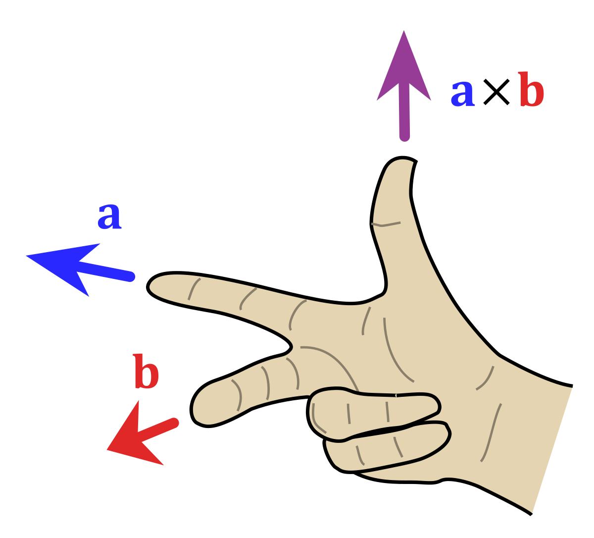

# Manual Feature Showcase

:::Intro (The-intro|Welcome to "The Guide")
In this guide, we will cover most of the features in the online manual renderer. Each section feature full examples as well as code snippets that will produce the examples. We also provide suggestions for how to use each feature.
:::


# Header Two

The first header in a markdown file is rendered as the title of the page. The second single-hashed header becomes Part I. Typically this should be an introduction section. Since it is the first thing that students will read, they will be less mentally fatigued and recall more of this information. It should summarize the 'big-picture' of the lab, and use visual elements such as images, videos and figures.


## Second Level Headers

Second  level headers are earmarked on the left navigation screen. This means that students can quickly navigate between parts and the subsections. Second level sections should thus be used to delinate important chunks of information. Unlike this,

### Third Level Headers

Third Level Headers and beyond will not generate a link, so they should be used to draw attention to important subcontent in  the section. 

# Special Elements

## @fa-wrench@ Materials List
Generate your Material List quickly with the following Code:

``` 
:::Materials (s|hi)
- item 1
- item 2
  - note for item 2
- item 3
:::
```
:::Materials (sasd|float-lg-start )
- item 1 ksdj alksd jalkd sjaksdlj  ksdj alksd jalkd sjaksdlj  ksdj alksd jalkd sjaksdlj 
- item 2
  - note for item 2
- item 3
:::

Floating materials
###### h6
:::Materials (|col-lg-4)
- item 1 asdasdjasdjal ksdj alksd jalkd sjaksdlj 
- item 2
  - note for item 2
- item 3
:::

Floating materials


## @fa-line-chart@ Figures

Figures and generally contain images. They are automatically numbered, nameable and have three types. The simplest will generate a full row div which breaks the text. 


``` 
:::Figure optional-name optional-size

:::
``` 
:::Figure (balls|) 

:::

To improve visual variety you can also make right and left floating figures, respectively. These will float to the right(left) of any text that *follows* it.


Right:
``` 
:::RFigure optional-name optional-size

:::
``` 


Left: 
``` 
:::LFigure optional-name optional-size


:::
``` 


The figure will not float next to this text because the text is placed above the image.

<p style="color:gray">Lorem ipsum dolor sit amet, consectetur adipiscing elit, sed do eiusmod tempor incididunt ut labore et dolore magna aliqua. Ut enim ad minim veniam, quis nostrud exercitation ullamco laboris nisi ut aliquip ex ea commodo consequat. Duis aute irure dolor in reprehenderit in voluptate velit esse cillum dolore eu fugiat nulla pariatur. Excepteur sint occaecat cupidatat non proident, sunt in culpa qui officia deserunt mollit anim id est laborum. </p>

:::RFigure (phyphox|m)

This is a right floating image
:::

It will, however, float to the right of text that follows. Floating figures are best used for tall images, or a figure containing multiple images.

<p style="color:gray">Lorem ipsum dolor sit amet, consectetur adipiscing elit, sed do eiusmod tempor incididunt ut labore et dolore magna aliqua. Ut enim ad minim veniam, quis nostrud exercitation ullamco laboris nisi ut aliquip ex ea commodo consequat. Duis aute irure dolor in reprehenderit in voluptate velit esse cillum dolore eu fugiat nulla pariatur. Excepteur sint occaecat cupidatat non proident, sunt in culpa qui officia deserunt mollit anim id est laborum.</p>

<p style="color:gray">Sed ut perspiciatis unde omnis iste natus error sit voluptatem accusantium doloremque laudantium, totam rem aperiam, eaque ipsa quae ab illo inventore veritatis et quasi architecto beatae vitae dicta sunt explicabo. Nemo enim ipsam voluptatem quia voluptas sit aspernatur aut odit aut fugit, sed quia consequuntur magni dolores eos qui ratione voluptatem sequi nesciunt. Neque porro quisquam est, qui dolorem ipsum quia dolor sit amet, consectetur, adipisci velit, sed quia non numquam eius modi tempora incidunt ut labore et dolore magnam aliquam quaerat voluptatem. Ut enim ad minima veniam, quis nostrum exercitationem ullam corporis suscipit laboriosam, nisi ut aliquid ex ea commodi consequatur? Quis autem vel eum iure reprehenderit qui in ea voluptate velit esse quam nihil molestiae consequatur, vel illum qui dolorem eum fugiat quo voluptas nulla pariatur?</p>


:::LFigure (graphs|m)

(a) The relationship between x and t is constant.

(b) The relationship between x and t is linear

(c) The relationship between x and t is quadratic
:::

You might worry that the images appear too small when multiple are in a figure, but the website automatically compiles *modals*. These are frames that pop up to show full-size media when clicked. Go ahead and click on of the images.

<p style="color:gray">Lorem ipsum dolor sit amet, consectetur adipiscing elit, sed do eiusmod tempor incididunt ut labore et dolore magna aliqua. Ut enim ad minim veniam, quis nostrud exercitation ullamco laboris nisi ut aliquip ex ea commodo consequat. Duis aute irure dolor in reprehenderit in voluptate velit esse cillum dolore eu fugiat nulla pariatur. Excepteur sint occaecat cupidatat non proident, sunt in culpa qui officia deserunt mollit anim id est laborum.</p>

<p style="color:gray">Sed ut perspiciatis unde omnis iste natus error sit voluptatem accusantium doloremque laudantium, totam rem aperiam, eaque ipsa quae ab illo inventore veritatis et quasi architecto beatae vitae dicta sunt explicabo. Nemo enim ipsam voluptatem quia voluptas sit aspernatur aut odit aut fugit, sed quia consequuntur magni dolores eos qui ratione voluptatem sequi nesciunt. Neque porro quisquam est, qui dolorem ipsum quia dolor sit amet, consectetur, adipisci velit, sed quia non numquam eius modi tempora incidunt ut labore et dolore magnam aliquam quaerat voluptatem. Ut enim ad minima veniam, quis nostrum exercitationem ullam corporis suscipit laboriosam, nisi ut aliquid ex ea commodi consequatur? Quis autem vel eum iure reprehenderit qui in ea voluptate velit esse quam nihil molestiae consequatur, vel illum qui dolorem eum fugiat quo voluptas nulla pariatur?</p>


## Figures: Advanced

### Sizing

To ensure that Figures look nice on large screens, one can specify a maximum size. These sizes, {xs, s, m ,l ,xl} are computed relative to the font size and constrain the height and width of an image to a square. The figures in the excercise below show variants of [Fi](#Fi-balls) with each size

:::::: Exercise (|Sizing Figures)

```
:::Figure (ball-o|)

**Original**
:::
```
:::Figure (ball-o|)


**Original**
:::

---


```
:::Figure (ball-xs|xs)


**xs**
:::

```

:::Figure (ball-xs|xs) 


**xs**
:::

---

```
:::Figure (ball-s|s) 


**s**
:::
```

:::Figure (ball-s|s)  


**s**
:::

---
```
:::Figure (ball-m|m) 


**m**
:::

```

:::Figure (ball-m|m) 


**m**
:::

---

```
:::Figure (ball-l|l) 


**l**
:::
```
:::Figure (ball-l|l) 


**l**
:::

---
```

:::Figure (ball-xl|xl) 


**xl**
:::
```

:::Figure (ball-xl|xl)  


**xl**
:::
::::::


### Columnation
In order to accommodate a row of images, the site makes use of W3.CSS standard columnization. Each full figure generates a row div class containing 12 equally sized columns. These are visualized in the figure below

:::::::::RowFigure
::::::row
:::col l1 dark
C1
:::
:::col l1 theme-l2
C2
:::
:::col l1 theme-l3
C3
:::
:::col l1 theme-l4
C4
:::
:::col l1 theme-l5
C5
:::
:::col l1 theme-l6
C6
:::
:::col l1 theme-l5
C7
:::
:::col l1 theme-l4
C8
:::
:::col l1 theme-l3
C9
:::
:::col l1 theme-l2
C10
:::
:::col l1 theme-l1
C11
:::
:::col l1 theme-l2
C12
:::
::::::
:::::::::


Within this, we can designate how many columns each part of the figure should take up large screens. The example below shows two images that each take up half of the horizontal space = 6 columns Note: all columns take up the full width on mobile and tablet sized screens.

```
:::::::::RowFigure (|m)
::::::row
:::col 


Part A: This figure takes up 6 of 12 rows
:::
:::col 


Part B: This figure takes up 6 of 12 rows
:::
::::::
:::::::::
```
::::::::RowFigure (|m)
::::::row
:::col 


Part A: This figure takes up 6 of 12 rows
:::
:::col 


Part B: This figure takes up 6 of 12 rows
:::
::::::
:::::::::


## @fa-superscript@ Equations

Just as important as figures, equations get their own box. Each equation is automatically numbered. Moreover, equations can be named and linked to later (see linking Section). 

```
:::Equation (equation_ref|optional-equation-title)
$$
\int_M K dA+\int_{\partial M}k_g ds=2\pi\chi(M)
$$
:::
```

:::Equation (gbt|The Gauss-Bonnet Theorem) 
$$
\int_M K dA+\int_{\partial M}k_g ds=2\pi\chi(M)
$$
:::


Equation markup uses standard KaTeX. For less important equations, KaTeX may be rendered in-line with single dollar signs `$a=\tfrac{1}{2}\pi r^2$`, e.g. : For our purposes [Eq](#Eq-gbt) can be reduced to the more familiar $a=\tfrac{1}{2}\pi r^2$

## @fa-question-circle@ Questions

Question boxes contain graded action items for students, and are brightly colored to draw attention to them. They are automatically numbered and may be linked to.

```
:::Question optional-name
Are you following along with this tutorial?
:::
```

:::Question following
Are you following along with this tutorial?
:::

Questions with multiple subparts are automatically labeled with lower-case letters.

```
:::Question
1. Using [Eq](#Eq-gbt) for the case of $d=2$ , derive the result $a=\tfrac{1}{2}\pi r^2$
2. How would this result change if $M$ was a manifold of genus 2? Discuss
:::
```

:::Question
1. Using [Eq](#Eq-gbt) for the case of $d=2$ , derive the result $a=\tfrac{1}{2}\pi r^2$
2. How would this result change if $M$ was a manifold of genus 2? Discuss
:::


## @fa-sitemap@ Exercises

Exercises are another important call-to-action for students. They act as a stand alone prompt with step-by-step instructions for completing part of a lab. They are automatically numbered and occur in full-width boxes so that any figures or questions within have sufficient readability.

```
:::::: Exercise optional-name
Firstly, let's measure the direction of magnetic field from the  magnet.
**Measurement steps:**
1. Put your phone on the table and open the phyphox app and go to “magnetometer”. You can see there are three plots, representing $B_x$,  $B_y$ and $B_z$.
2. Start recording. You should see some random fluctuations on the plot. 
3. Hold the magnet above the magnetomer, with one flat side facing up. Move it up and down above the magnetometer.
4.  Now flip the magnet over, and repeat the motion.
5.  Stop recording to view the collected data. 

::: Question
1. Why does $B_z$ change when you move the magnet vertically?
2. At the point where you flipped the magnet, describe the difference you observe, and give a possible explanation.
:::
::::::
```

:::::: Exercise magnetic-field
Firstly, let's measure the direction of magnetic field from the  magnet.
**Measurement steps:**
1. Put your phone on the table and open the phyphox app and go to “magnetometer”. You can see there are three plots, representing $B_x$,  $B_y$ and $B_z$.
2. Start recording. You should see some random fluctuations on the plot. 
3. Hold the magnet above the magnetomer, with one flat side facing up. Move it up and down above the magnetometer.
4.  Now flip the magnet over, and repeat the motion.
5.  Stop recording to view the collected data. 

::: Question
1. Why does $B_z$ change when you move the magnet vertically?
2. At the point where you flipped the magnet, describe the difference you observe, and give a possible explanation.
:::
::::::


## @fa-video-camera@ Videos

Videos can be added directly via iframe since html is enabled. Use the Video container to keep them labeled

```
:::Video
<iframe  src="https://www.youtube.com/embed/PT6GM85ut4I" frameborder="0" allow="accelerometer; autoplay; clipboard-write; encrypted-media; gyroscope; picture-in-picture" allowfullscreen></iframe>
:::

```
:::Video
<iframe  src="https://www.youtube.com/embed/PT6GM85ut4I" frameborder="0" allow="accelerometer; autoplay; clipboard-write; encrypted-media; gyroscope; picture-in-picture" allowfullscreen></iframe>
:::

## @fa-space-shuttle@ Simulations


Simulations work the same as everything else, and collapse to save space when they aren't needed:

```
::: Simulation optional-name
<iframe src="https://kapawlak.github.io/PhDemoJS/Apps/BiotSavart_Current_Line/Biot_Savart.html" width= "100%" height="800" style="border:none;"></iframe>
:::
```

::: Simulation long-wire
<iframe src="https://kapawlak.github.io/PhDemoJS/Apps/BiotSavart_Current_Line/Biot_Savart.html" width= "100%" height="800" style="border:none;"></iframe>
:::

## @fa-warning@ Notes, Warnings, Tables

### Notes
Notes are small blurbs meant to call students' attention to a potential pitfall, or a subtly they might otherwise miss

```
::: Note
Pay attention to how many colons you use in your markdown container!
:::
```

::: Note
Pay attention to how many colons you use in your markdown container!
:::

### Warnings
Warnings are like notes, but indicate possible *danger* to the student. To make sure they are seen, they are colored obnoxiously and shake until clicked on

```
::: Warning
Knives are sharp and not a toy!
(click to dismiss)
:::
```

::: Warning
Knives are sharp and not a toy!
(click to dismiss)
:::

### Tables

Tables are as usual, and will fill the entire width available. If the width is not long enough to display the table, the table will become scrollable 

```
:::Table
|Offset  $y$  | $R$ |$1/R$  | Measured $B_y$   |Measured $B_z$  | Field strength $B$ |
|------|------|------|------|------|------|
|@fa-pencil@    |      |      |      |      |      |     
|@fa-pencil@   |      |      |      |      |      |   
|@fa-pencil@    |      |      |      |      |      |   
|@fa-pencil@   |      |      |      |      |      |        
:::
```

:::Table
|Offset  $y$  | $R$ |$1/R$  | Measured $B_y$   |Measured $B_z$  | Field strength $B$ |
|------|------|------|------|------|------|
|@fa-pencil@    |      |      |      |      |      |     
|@fa-pencil@   |      |      |      |      |      |   
|@fa-pencil@    |      |      |      |      |      |   
|@fa-pencil@   |      |      |      |      |      |        
:::

### Plain Card

```
:::Card (ref|optional header|optional footer|style)
These are contents
:::

```
:::Card (ref|optional header|optional footer|style)
These are contents
:::

The style option will accept coloring classes. Here I am coloring the card background UCSB Navy and the text white.


```
:::Card (ref|header|footer|bg-UCSB-navy-50 text-white)
These are contents
:::
```
:::Card (ref|header|footer|bg-UCSB-navy text-white)
These are contents
:::

:::::::::Hider (color-classes|Full List of Colors to add to 'bg-' or 'text-')
::::::row

:::col
<small class="bg-UCSB-navy text-white p-2">UCSB-navy</small>
:::
:::col
<small class="bg-UCSB-gold text-white p-2">UCSB-gold</small>
:::
:::col
<small class="bg-UCSB-seagreen text-white p-2">UCSB-seagreen</small>
:::
:::col
<small class="bg-UCSB-aqua text-white p-2">UCSB-aqua</small>
:::

:::col
<small class="bg-UCSB-coral text-white p-2">UCSB-coral</small>
:::
:::col
<small class="bg-UCSB-moss text-white p-2">UCSB-moss</small>
:::

::::::
::::::row
:::col
<small class="bg-UCSB-mist text-black p-2">UCSB-mist</small>
:::
:::col
<small class="bg-UCSB-clay text-black p-2">UCSB-clay</small>
:::
:::col
<small class="bg-UCSB-sandstone text-black p-2">UCSB-sandstone</small>
:::
:::col
<small class="bg-UCSB-lightgray text-black p-2">UCSB-lightgray</small>
:::
:::col
<small class="bg-dark text-white p-2">dark</small>
:::
:::col
<small class="bg-white text-dark p-2">white</small>
:::

::::::row
:::col
<small class="bg-primary text-white p-2">primary</small>
:::
:::col
<small class="bg-secondary text-white p-2">secondary</small>
:::
:::col
<small class="bg-success text-white p-2">success</small>
:::
:::col
<small class="bg-info text-black p-2">info</small>
:::
:::col
<small class="bg-warning text-black p-2">warning</small>
:::
:::col
<small class="bg-danger text-black p-2">danger</small>
:::


::::::

:::::::::


# Other Features

## Linking (WIP)

Linking allows you to reference previous named material, autogenerating a link to the place on the page it is located and the correct description of the item. The syntax is `[Eq](#Eq-gbt)`

:::Figure

`[Eq](#Eq-gbt) is an Equation link to the Gauss-Bonnet Theorem`

[Eq](#Eq-gbt) is an Equation link to the Gauss-Bonnet Theorem

`[Qu](#Qu-following) is a Question link to the "Are you following?" question`

[Qu](#Qu-following) is a Question link to the "Are you following?" question


`[Fi](#Fi-balls) is a Figure link to the balls figure`

[Fi](#Fi-balls) is a Figure link to the balls figure


`[Ex](#Ex-magnetic-field) is an Exercise link to the Magnetic Strength Exercise` 

[Ex](#Ex-magnetic-field) is an Exercise link to the Magnetic Strength Exercise

`[Si](#Si-long-wire) is a Simulation link to the Biot Savart Simulation ` 

[Si](#Si-long-wire) is a Simulation link to the Biot Savart Simulation

To name a Figure, Equation, Question, Exercise or Simulation element, simply provide a name directly after the declaration (on the same line). 

:::


## Nested Elements

To nest elements, you must include additional colons for each level of nesting within the element

```
:::::::::Exercise
In this exercise, you will do stuff.

:::Figure

:::

::::::Question
Look at the image below and write the first word that comes to mind

:::Figure

:::
::::::
:::::::::
```

:::::::::Exercise
In this exercise, you will do stuff.

:::Figure

:::

::::::Question
Look at the image below and write the first word that comes to mind

:::Figure

:::
::::::
:::::::::

## Iconography

You can use any icons from [Font Awesome 4.7](https://fontawesome.com/v4.7.0/icons/) by sandwiching the icon name with @ symbols
```
@fa-thumbs-up@
@fa-area-chart@
@fa-briefcase@
@fa-check@
@fa-gear@
```

@fa-thumbs-up@
@fa-area-chart@
@fa-briefcase@
@fa-check@
@fa-gear@
## Foot Notes


Footnotes are automatically numbered and create small popups on the bottom of the screen that linger for a few seconds to allow for clicking. These are inserted using:

```
[fn]An interesting and informative comment appears here, as if by magic. [http://www.google.com](http://www.google.com)[/fn]
```

  You can see the effect by hovering over the number[fn]An interesting and informative comment appears here, as if by magic. [http://www.google.com](http://www.google.com)[/fn]. 

## Hider

A Hider is good for letting students check their understanding or condensing a less important block of information. To title the Hider, type something after decalring it *without* a line break.

```
:::Hider (drop|If you drop a magnet down a conducting tube, which direction will the force be applied?)

Upwards! Or, more correctly, in the direction opposite of the gravitational force accelerating it

:::
```

:::Hider (drop|If you drop a magnet down a conducting tube, which direction will the force be applied?)

Upwards! Or, more correctly, in the opposite direction of the gravitational force accelerating it

:::

::: Question
with text that hangs out above?

1. Why does $B_z$ change when you move the magnet vertically?
2. At the point where you flipped the magnet, describe the difference you observe, and give a possible explanation.
3. Testing footnote with $\LaTeX m$ that adds span. [fn] This is a footnote with $\LaTeX \vec{F_{tot}}$ inside [/fn]
4. Testing footnote with $\LaTeX m$ that adds span. [fn] This is a footnote with $\LaTeX F_{tot}$ inside [/fn]
:::

## HTML

HTML is enabled in this markdown compiler, so if you need to include something beyond the scope of what is provided, you can directly code it in. Check out the [Course Info](?linkfile=courseinfo) page to see an example


# Conclusion

## Add a Summary

```
::: Summary
Please turn in your report [here](https://gauchospace.ucsb.edu/courses/my/)
:::
```

::: Summary
Please turn in your report [here](https://gauchospace.ucsb.edu/courses/my/)
:::


# Test
:::::: Exercise (magnetic-field2|)
Firstly, let's measure the direction of magnetic field from the  magnet.
**Measurement steps:**
1. Put your phone on the table and open the phyphox app and go to “magnetometer”. You can see there are three plots, representing $B_x$,  $B_y$ and $B_z$.
2. Start recording. You should see some random fluctuations on the plot. 
3. Hold the magnet above the magnetomer, with one flat side facing up. Move it up and down above the magnetometer.
4.  Now flip the magnet over, and repeat the motion.
5.  Stop recording to view the collected data. 
::: Simulation long-wire2
<iframe src="https://kapawlak.github.io/PhDemoJS/Apps/BiotSavart_Current_Line/Biot_Savart.html" width= "100%" height="800" style="border:none;"></iframe>
:::
::: Question
1. Why does $B_z$ change when you move the magnet vertically?
2. At the point where you flipped the magnet, describe the difference you observe, and give a possible explanation.
3. Testing footnote [fn] this is a footnote [/fn]
:::
::::::


::::::Figure (named|)
Firstly, let's measure the direction of magnetic field from the  magnet.
**Measurement steps:**
1. Put your phone on the table and open the phyphox app and go to “magnetometer”. You can see there are three plots, representing $B_x$,  $B_y$ and $B_z$.
2. Start recording. You should see some random fluctuations on the plot. 
3. Hold the magnet above the magnetomer, with one flat side facing up. Move it up and down above the magnetometer.
4.  Now flip the magnet over, and repeat the motion.
5.  Stop recording to view the collected data. 
::: Simulation long-wire25
<iframe src="https://kapawlak.github.io/PhDemoJS/Apps/BiotSavart_Current_Line/Biot_Savart.html" width= "100%" height="800" style="border:none;"></iframe>
:::
::: Question
1. Why does $B_z$ change when you move the magnet vertically?
2. At the point where you flipped the magnet, describe the difference you observe, and give a possible explanation.
:::
::::::

# This is another part!

does the text render inside or outside?
:::Question
This is text
- it has
- an unordered
- list inside

Does it show correctly now?
:::


## test1

## test2

